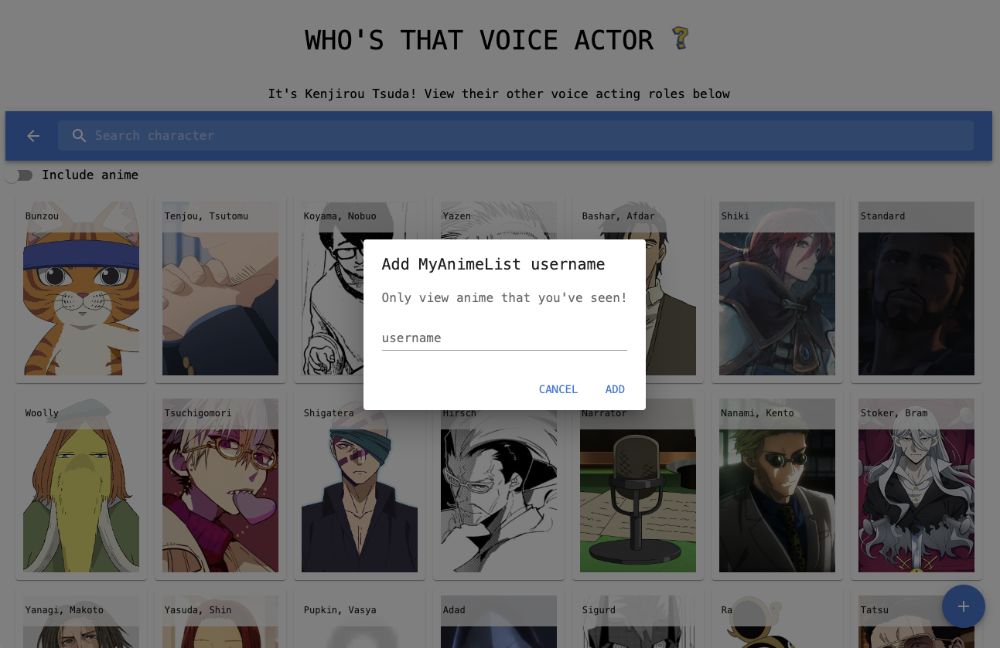

# Who's that voice actor? (Voice Actor Finder App)

## About
* Figure out where you have heard that voice actor before!
* View other anime that the selected voice actor has been in
* Add MyAnimeList username to view only completed anime

* Frontend: React, Backend: Python (MAL/JIKAN API)

### 1. Search or select an anime
 

### 2. Select a character
 

### 3. Find out the voice actor and their other roles
 

### Add your MyAnimeList username to only display anime you've watched
 

## Installation

1. Get a free API Key at [https://myanimelist.net/apiconfig](https://myanimelist.net/apiconfig)
2. Enter your MAL API Key in `.env` (backend directory)
   ```
   MAL_CLIENT_ID = 'ENTER YOUR API';
   ```
3. Enter your base URL in `.env` (frontend directory)
   ```
   BASE_URL = 'ENTER YOUR BACKEND URL';
   ```
4. Run using Docker
   ```
   docker compose build
   docker compose up
   ```